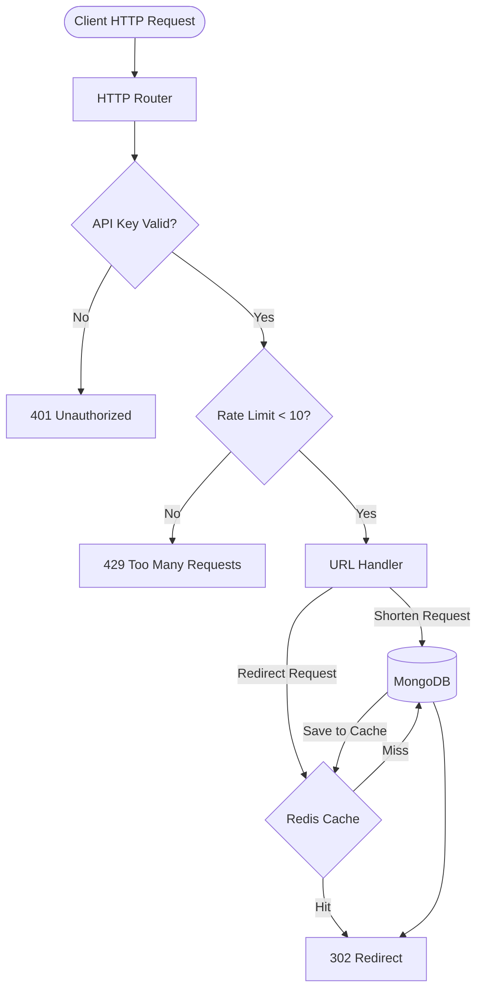

# Enterprise URL Shortener Service


A highly scalable, production-grade URL Shortener backend service built in **Go**. This project demonstrates enterprise backend architecture patterns including cache-aside strategies, middleware-based request validation, API key authentication, and distributed rate limiting.

## Key Features

- **Blazing Fast Redirects**: Implements a Cache-Aside pattern with Redis to ensure sub-millisecond redirect latency.
- **Secure API Authentication**: Cryptographically secure API keys generated per client with configurable expiration dates (30 days).
- **Distributed Rate Limiting**: Fixed-window rate limiting (10 requests/minute per API key) managed in Redis to prevent abuse.
- **Custom URL Aliases**: Users can provide custom short codes (e.g., `/my-brand`) or rely on the secure Base62 random code generator.
- **Data Integrity**: Enforced via MongoDB unique indexes for API keys and short codes.

## System Architecture

The application is structured using a clean, layered architecture separating routing, middleware, handlers, services, and data access.



## 🛠️ Technology Stack

- **Language**: Go (Golang)
- **Primary Database**: MongoDB (Persistent storage for URLs and API Keys)
- **Cache & Rate Limiter**: Redis (In-memory data structure store)
- **Routing**: Standard Go `net/http` library

## Project Structure

```text
.
├── cmd/
│   └── main.go                  # Application entry point & route registration
├── internal/
│   ├── db/                      # Database connection logic (Mongo, Redis) & Indexes
│   ├── handlers/                # HTTP request handlers (Core business logic)
│   ├── middleware/              # Request interceptors (Auth, Rate Limiting)
│   ├── models/                  # Data structures (BSON/JSON schemas)
│   ├── services/                # Business services (API Key generation)
│   └── utils/                   # Utility functions (Random String Generator)
├── .env                         # Environment variables
├── go.mod                       # Go module dependencies
└── Readme.md                    # Project documentation
```

## Getting Started

### Prerequisites

Ensure you have the following installed on your local machine:
- [Go](https://golang.org/doc/install) (v1.20+)
- [MongoDB](https://www.mongodb.com/try/download/community) (Running on `localhost:27017`)
- [Redis](https://redis.io/download) (Running on `localhost:6379`)

### Installation & Execution

1. **Navigate to the directory**:
   ```bash
   cd "URL shortner"
   ```

2. **Install dependencies**:
   ```bash
   go mod download
   ```

3. **Start the server**:
   ```bash
   go run cmd/main.go
   ```
   *The server will start listening on port `8080`.*

---

## API Documentation

### 1. Generate API Key
Generates a new API key for a client. Valid for 30 days.

- **URL**: `/api/key`
- **Method**: `POST`
- **Body**:
  ```json
  {
    "client": "frontend-app"
  }
  ```
- **Success Response**:
  ```json
  {
    "api_key": "c4d...3f2",
    "client": "frontend-app",
    "expires_at": "2026-06-12T10:00:00Z"
  }
  ```

### 2. Shorten URL
Creates a short URL for the provided original URL. **Requires API Key.**

- **URL**: `/shorten`
- **Method**: `POST`
- **Headers**: 
  - `X-API-Key: <your_api_key>`
- **Body**:
  ```json
  {
    "url": "https://www.example.com/very/long/path",
    "alias": "custom-name" // Optional
  }
  ```
- **Success Response**:
  ```json
  {
    "short_url": "http://localhost:8080/custom-name"
  }
  ```
- **Error Responses**:
  - `401 Unauthorized`: Missing, expired, or invalid API key.
  - `429 Too Many Requests`: Exceeded 10 requests per minute limit.
  - `400 Bad Request`: Invalid URL format.
  - `409 Conflict`: Alias already taken.

### 3. Redirect
Redirects the user to the original URL.

- **URL**: `/<short_code>`
- **Method**: `GET`
- **Behavior**: Fast redirects using Redis Cache-Aside pattern. Returns `404 Not Found` if the code does not exist.

---

##  Rate Limiting Mechanics
- **Strategy**: Fixed Window Counter
- **Storage**: Redis `INCR` and `EXPIRE` commands
- **Limit**: 10 requests per minute, per API Key.
- **Client Transparency**: Headers provided to the client include `X-RateLimit-Limit`, `X-RateLimit-Remaining`, and `Retry-After`.

---
*Developed by Channabasava Ballolli*
